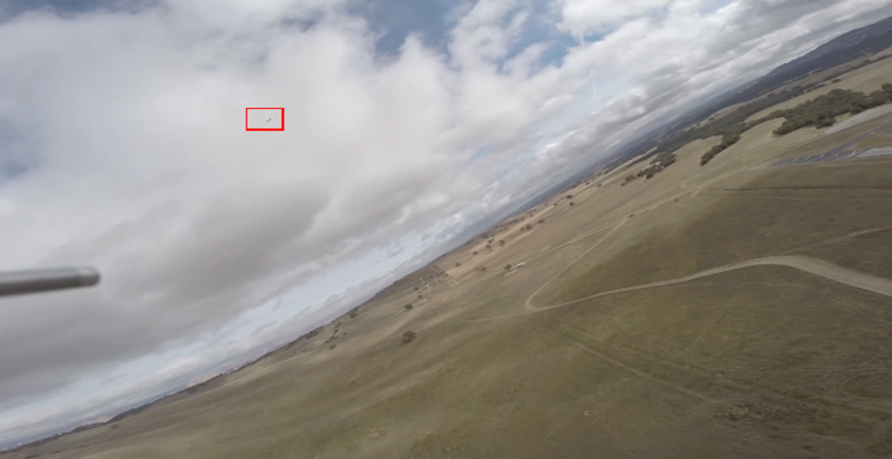
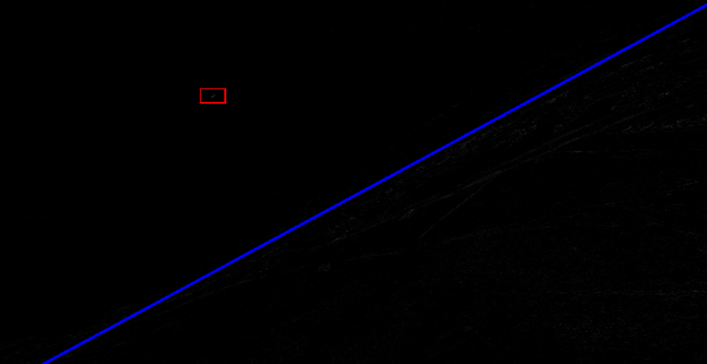

# Collision-Avoidance-System
A Vision Based Sense and Avoid System for Small UAV's.

Input:

Border and Filter:

---

### Files :

main.py   ->  Image and Video functions

utils.py  ->  All utility functions

---

### TODO :

- [x] Border and CMO filter
- [ ] HMM Filters
- [ ] Tracking obstacle

---

### Tried : 

- ~~CNN~~
- ~~YOLO~~
- ~~LK~~
